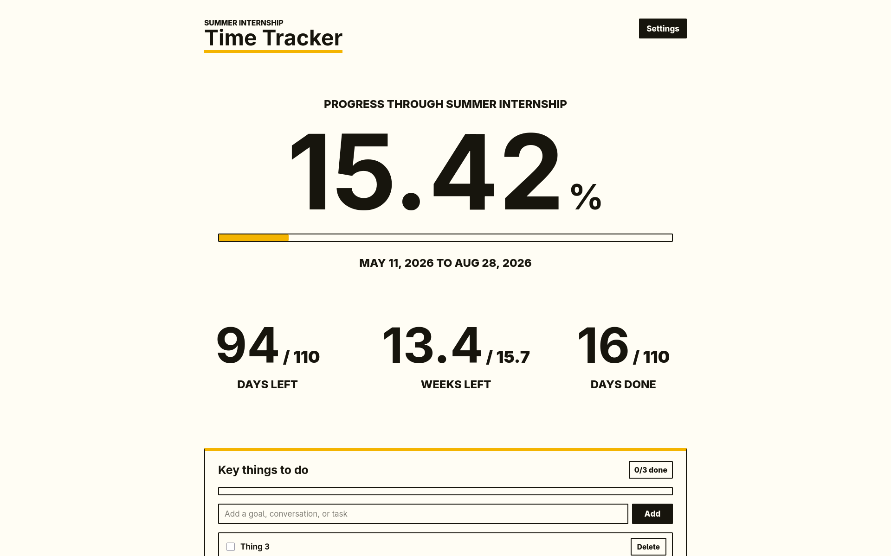

# Time Tracker

A small personal progress tracker.



## Features

- Tracks percent complete, days left, weeks left, and days done
- Custom event name, dates, and accent color
- Simple todo list for goals to finish before the event ends

## Run Locally

Install dependencies:

```sh
npm install
```

Start the local dev server:

```sh
npm run dev
```

Open:

```txt
http://localhost:5173/
```

## Build

Create a production build:

```sh
npm run build
```

Preview the production build:

```sh
npm run preview
```

Open:

```txt
http://localhost:4173/
```

## Docker

Build and run:

```sh
mkdir -p data
docker build -t time-tracker .
docker run --rm -p 4173:4173 -v ./data:/app/data -e PREVIEW_ALLOWED_HOSTS=your.domain.example time-tracker
```

Or use the compose example:

```sh
PREVIEW_ALLOWED_HOSTS=your.domain.example docker compose -f docker-compose.example.yml up --build
```

Server state is stored in `data/state.json` and persisted with the local `./data` bind mount.

Set `PREVIEW_ALLOWED_HOSTS` to the hostname you use to access the app. For multiple hostnames, use a comma-separated list.
